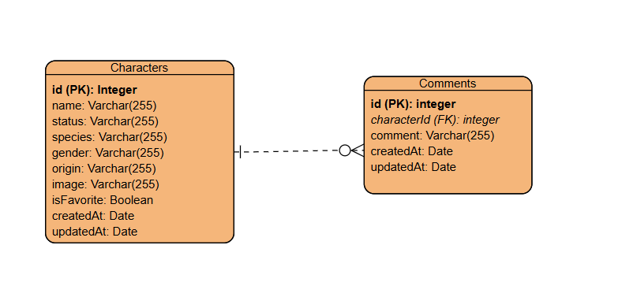

# Rick and Morty

This project implements a full-stack application that allows users to explore characters from the Rick and Morty universe.

The project includes:

- **GraphQL API** built with Node.js, Express, PostgreSQL, Redis, and Docker.
- **React frontend** built with React 18, Apollo Client, and TailwindCSS.

# 1. API

This project implements a GraphQL API that fetches, stores, and serves character data from the Rick and Morty API.

The application is built with Node.js, Express, GraphQL, PostgreSQL, Redis, and Docker.

## - Execution

- You must create the .env file in api folder with the following variables:
  - DEV=true
  - PORT=4000
  - POSTGRES_DB="rickmorty"
  - POSTGRES_USER="postgres"
  - POSTGRES_PASSWORD="postgres"
  - POSTGRES_HOST="postgres"

- At the root of the project run:
  `docker compose up --build`

- The application will start on port 4000

## - Architecture

The API follows a layered architecture:

Resolvers → Services → Database

GraphQL resolvers handle incoming queries and delegate business logic to services.

Services interact with the database using Sequelize ORM.

Redis is used as a caching layer to improve performance.

## Technologies

- Node.js
- GraphQL
- Apollo Server
- Express
- PostgreSQL
- Sequelize
- Redis
- Docker
- TypeScript
- node-cron
- jest

## Features

- GraphQL API for querying characters
- Redis caching for optimized query performance
- PostgreSQL database persistence
- Migration to create the comments and characters tables and add column isFavorite.
- Automatic seeding of characters from Rick and Morty API
- Character filters: Status, Species, Gender, Name and Origin.
- Middleware that logs relevant information for each request.

## Optional Features

- Scheduled updates using a cron job every 12 hours.
- Execution time logging using a custom method decorator.
- Implement unit test for character search query.
- The project is implemented using TypeScript.
- Allow ordering characters ASC/DESC by name or any attribute.

## Additional Features

- Filter character by isFavorite
- Query comments by character
- Allow order for any attribute
- Allow delete character
- Allow create comment

## Test

Execute the test with this command:
`npm test`

## Swagger

Swagger documentation is available at: http://localhost:4000/docs/

## MER

# 2. FRONT

This project is the frontend application for the Rick & Morty Characters platform.
It allows users to explore characters, filter them, mark favorites, and add comments.

The application consumes a GraphQL API built with Express, Sequelize, and Redis.

## - Execution

- You must create the .env file in api folder with the following variables:
  - VITE_HOST=http://localhost:4000

- Install dependencies.
  `npm install`

- Run the development server
  npm run dev

The application will start at: http://localhost:5173

**_NOTE:_** Make sure the backend GraphQL API is running before starting the frontend.

## Architecture

The frontend follows a component-based architecture using React and separates concerns into different layers.

Main concepts:

- api → Connection with GraphQL

- Pages → Route-level components

- Components → Reusable UI pieces

- GraphQL → Queries and mutations

- Hooks → Custom hooks

## Technologies

- React 18
- TypeScript
- Apollo Client
- GraphQL
- React Router
- TailwindCSS
- Jest
- Testing Library

## Features

- Displays characters retrieved from the GraphQL API.
- Characters are presented as cards showing:
  - Name
  - Image
  - Species
- Layout built using CSS Grid and Flexbox to ensure responsiveness.
- Characters can be sorted by name:
  - A → Z
  - Z → A
- Clicking on a character card navigates to a detail page using React Router.
- Users can mark or unmark characters as favorites.
- Favorite state is persisted through the backend API.
- Users can add comments to characters.
- Comments are displayed in the character detail page.
- The application is fully responsive with TailwindCSS.

## Optional Features

- Characters can be filtered by: Status, Species and Gender
- Characters can be deleted from the database
- The project is implemented using TypeScript.
- Test for index page, filters, detail character component and comments component.

## Additional Features

- Debounce for text filter.
- Type definitions for API requests
- Comments list
- Validation for delete character.
- Favorites filter
- Toast for alerts

## Test

Execute the test with this command:
`npm test`
